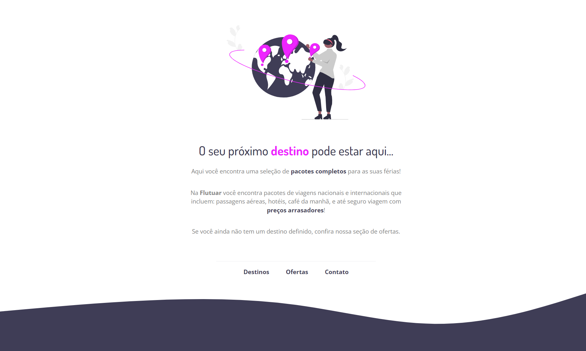

# Projeto 01

Projeto extra feito pra treinar alguns conceitos de HTML e CSS, a partir de um layout no Figma, vistos na aula do stage 2 da Rocketseat.

## Tecnologias
- HTML  
- CSS  
- Git

## Layout
Você pode visualizar o layout do projeto através [desse link](<https://www.figma.com/file/waisYRoNzeBgIxOyrz0b2R/Projeto01-Extra/duplicate>).  
É necessário ter uma conta no [Figma](https://www.figma.com).
 

  

